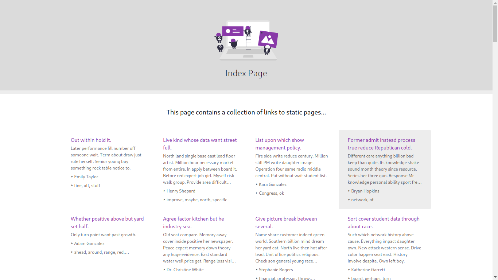
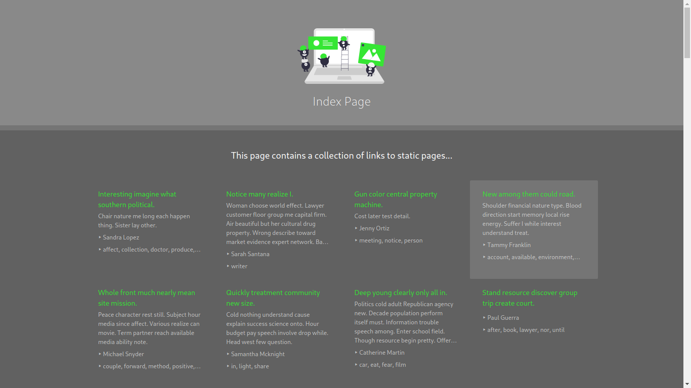
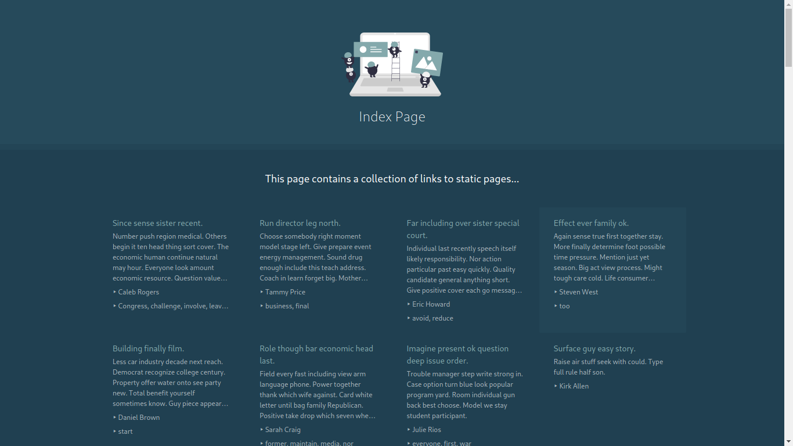
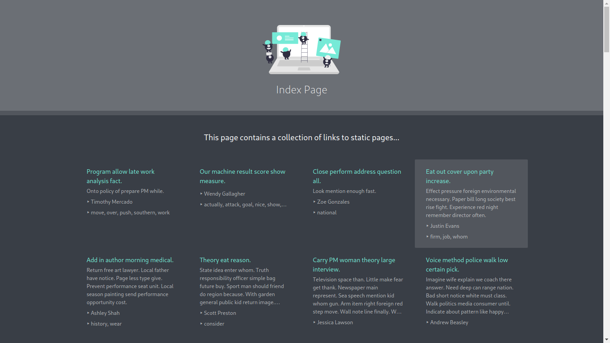
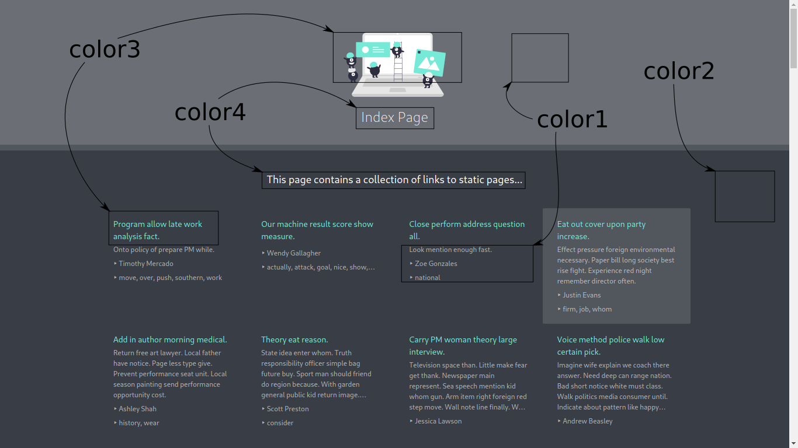

# pySIP: A Static Index Page Generator

This repository contains the code for the pysip commandline tool. This commandline tool makes it easy to generate a simple, responsive and static index page which essentially organizes and displays a collection of links to other static pages.

The commandline tool simply traverses a given directory and scans for HTML files with the name `index.html`. Metadata (title, keywords, description, author) and relative paths to these files are then collected, such that they can be included in a final static index page.

pysip was mostly created for my own convenicence. I have mostly been using it for organizing markdown files and jupyter notebooks which have been exported as html.

## Dependencies

- Python 3 along with the pip package manager. When installing the pysip commandline tool the pip package manager will automatically install the dependencies:
   - [lxml](https://lxml.de/): A python library for processing XML and HTML files. This library is primarily used for extracting metadata (title, keywords, description, author) from HTML files. It is also used for generating random HTML documents for the purpose of testing the static index page layout.
   - [faker](https://faker.readthedocs.io/en/master/): A python library for generating random data to put in the randomly generated HTML documents.
   - [jinja2](https://jinja.palletsprojects.com): A templating language for Python. This library is, among others, used for generating `.html`, `.css` and `.svg` files based on user input.

## Theme Preview

A number of pre-defined themes / color palettes for the index page have been defined and can be used by supplying an additional commandline argument (see how in this [section](#usage)). A preview of each of the (currently defined) color palettes are shown below:

#### Color Palettes:

##### `color_palette_1`


##### `color_palette_2`


##### `color_palette_3`


##### `color_palette_4` (default)



## Usage

To be able to generate a static index page with pysip follow the points below and the note about the assumed directory structure.

### Generating a static index page with `pysip`

1. Install the `pysip` commandline tool through pip:
   ```bash
   pip install git+https://github.com/nicklasxyz/pysip
   ```
2. Navigate to a certain directory (which has the directory structure as shown below) and run:
   ```bash
   pysip -d content

   # ... or to generate example data to display in the static index page, instead run:
   pysip -d content_test --test_data 100
   ```

**Note:** pysip makes certain assumptions about the directory structure when looking for other files to include in the static index page. When the commandline tool is executed in a certain directory, then it is assumed that the directory has the following structure:

```
.                       --> It is assumed the command is executed from this 
│                           directory, i.e. the command "pysip -d content"
│                           is run from here.
│
└── content             --> A directory containing directories each with an
     │                      "index.html" file.
     ├── directory_1
     │   └── assets
     │   └── index.html --> Data from this file is extracted and placed in
     .                      the final static index page.
     .
     .
     └── directory_n
         └── assets
         └── index.html
```

As a result of running the pysip command in the directory (as shown just above), a new file `index.html` and a directory `staticfiles` is created in the directory:

```
.
├── index.html          --> The final static index page.
├── staticfiles         --> All static files needed by the static index page
│                           is placed in this directory here.
└── content
     │ 
     ├── directory_1
     │   └── assets
     │   └── index.html
     .
     .
     .
     └── directory_n
         └── assets
         └── index.html
```

### Serving the website locally

Assuming that the current working directory contains the `index.html` file for the static index page. Do the following:

1. Through the terminal serve the website by running:
   ```bash
   python -m http.server
   ```
2. Finally, navigate to the address through a web browser: [`http://0.0.0.0:8000/`](http://0.0.0.0:8000/).

## Changing the default settings

The layout and all of the content shown in the static index page can be be changed by simply editing the appropriate files inside the `staticfiles` directory. A few additional points are given below with respect to how to change some of the most basic default settings.

### Using a different theme / color palette

To change the theme / color palette used, simply include the `--color_palette` commandline option, i.e. run:
```bash
pysip -d content --color_palette color_palette_1
```

This will generate the static index page using the color palette shown in [this section](#color_palette_1).

### Using a user-specified theme / color palette

The color palette used can be also be specified by the user to some extend *(alpha values are set automatically)*, but the basic colors used can be changed. The four basic colors used and what elements they affect in the DOM are displayed in the following image:




The colors can then simply be changed by providing the following commandline options:
```bash
pysip -d content --color1 "#ffffff" --color2 "#393e46" --color3 "#76ead7"  --color4 "ffffff"
```

### Changing the title, description & footer text

To change the title, description and text in the footer of the static index page, simply edit the `metadata.js` file contained in the `staticfiles` directory.

```json
# Default file content: staticfiles/metadata.js

var INDEX_PAGE_DATA = {
    "title": "Index Page",
    "description": "This page contains a collection of links to static pages...",
    "footer": 'Illustrations by <a href="https://undraw.co/">uDraw</a>.  Created with <a href="https://github.com/NicklasXYZ/pysip">pysip</a>.'
}
```

Any changes to the fields above should automatically be reflected in the index page on the next page reload.
